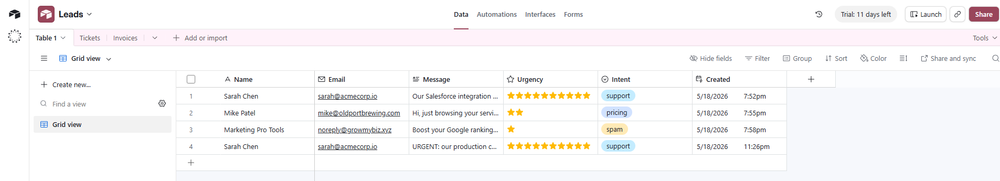
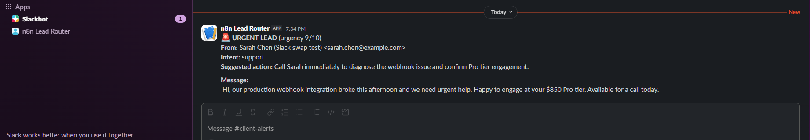
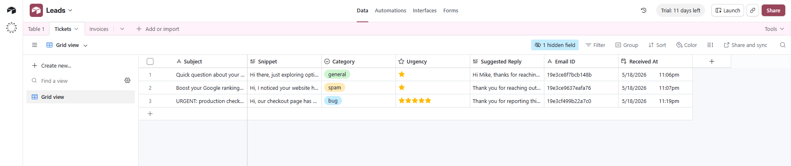
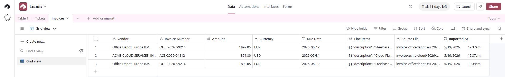

# n8n + Claude API automations for SMB operations

I build production n8n workflows that use the Anthropic Claude API to do the classification, extraction, and routing work small businesses currently do by hand. This repo is the portfolio: three real workflows, sample outputs, design notes, and hire info.

If you're a small business drowning in inbound messages, support tickets, or invoices, the [Hire me](#hire-me) section below is the short path. If you want to see the work first, scroll on.

## The three workflows in this portfolio

| Workflow | Trigger | What it does | Time-sink it eliminates |
|---|---|---|---|
| 1. Lead Intake | Webhook (contact form) | Claude classifies inbound submissions (is-lead / is-spam / urgency / intent / suggested action); writes to Airtable CRM; pings Slack on urgent | The 20-minute "scan the inbox, file it, decide who to wake up" ritual after every form submit |
| 2. Support Triage | Gmail polling | Claude classifies inbox emails (category / urgency / draft reply); writes to Airtable Tickets; pings Slack on urgent | The morning + afternoon read-judge-file-draft-Slack ritual for any inbox doing double duty as support |
| 3. Invoice Parser | Google Drive polling | n8n extracts PDF text; Claude pulls out vendor, invoice number, total, currency, due date, line items; writes to Airtable Invoices | The monthly invoice-pile ritual of opening each PDF and copying fields into a sheet by hand |

Each workflow has its own description file (`workflow-N-description.md`) covering target user, dollar value captured, and the implementation tradeoffs.

## Proof these workflows actually work

Real screenshots from each workflow running end-to-end on the same n8n install. Synthetic test data; no real PII. Full per-shot context in [sample-outputs/README.md](sample-outputs/README.md).

**Workflow 1 — Airtable Leads + Slack alert**




**Workflow 2 — Airtable Tickets**



**Workflow 3 — Airtable Invoices**



## Hire me

This is a portfolio, not a self-install repo. The deliverable is a working automation in your environment — you don't have to learn n8n, write Claude prompts, or wire OAuth.

### What you get with any tier

- One or more n8n workflows running on a VPS you control (or your existing n8n instance)
- Anthropic API key, Airtable PAT, Slack webhook, Google OAuth — all wired and tested against your real data before handover
- A 30-min to 2-hour handover call walking through how to operate, tune, and extend
- 14-day post-delivery support, free bug fixes (feature changes at hourly rate)
- The workflow JSONs, system prompts, and credentials are yours; you keep everything

### Tiers

| Tier | Price | Includes | Turnaround |
|---|---|---|---|
| **Starter** | $400 | One custom workflow, your trigger plus your destination, Claude classification or extraction in between | 1 to 3 business days |
| **Pro** | $850 | Three coordinated workflows sharing a CRM, Slack routing on urgent items, complete handover | 3 to 10 business days |
| **Business** | $1,200 | Full intake + triage + invoice processing + analytics dashboard | 5 to 14 business days |
| **Hourly** | $55/hr | Custom scope, ongoing maintenance, migrations from Zapier or Make | as scoped |

### How an engagement works

1. Send a message describing the bottleneck you want gone. I reply within 24 hours
2. Free 20-minute discovery call or chat to scope the problem
3. Fixed-price quote with deliverables and turnaround locked in
4. Build in n8n, test against your real data, hand off on a recorded call

### Upwork

[`upwork.com/freelancers/~01c7609d38031dc2df`](https://www.upwork.com/freelancers/~01c7609d38031dc2df)

## What this costs you to run (after I'm done)

Claude Haiku 4.5 pricing is approximately $0.80 per million input tokens and $4 per million output tokens. Real per-execution costs measured during portfolio development:

| Workflow | Tokens per execution (in / out) | Cost per execution |
|---|---|---|
| Lead Intake | ~500 / ~150 | ~$0.001 |
| Support Triage | ~600 / ~200 | ~$0.001 |
| Invoice Parser | ~1500 / ~250 | ~$0.002 |

Projected monthly Claude API spend at typical SMB volumes:

| Volume profile | Lead Intake | Support Triage | Invoice Parser | Monthly Claude total |
|---|---|---|---|---|
| Light (100 / 200 / 20 per month) | $0.10 | $0.20 | $0.04 | **~$0.34** |
| Typical (500 / 1000 / 100 per month) | $0.50 | $1.00 | $0.20 | **~$1.70** |
| Heavy (2000 / 5000 / 500 per month) | $2.00 | $5.00 | $1.00 | **~$8.00** |

Airtable free tier and self-hosted n8n add $0. A $5/month Hetzner or DigitalOcean VPS for production n8n brings the all-in monthly bill to under $15 even at the heavy profile. The whole stack runs cheaper than most teams' monthly coffee budget.

## Stack and design choices

**Stack:** n8n 2.20+ (self-hosted on a $5 VPS), Anthropic Claude API (Haiku 4.5 model via the generic HTTP Request node with Header Auth), Airtable for the CRM/database layer, Gmail and Google Drive for triggers, Slack for alerts.

**Design patterns reused across all three workflows:**

- **Defensive JSON parsing.** Claude occasionally wraps its JSON output in markdown code fences. Every Parse node strips fences and falls back to a regex extraction of the first `{...}` block before `JSON.parse`. A parse failure produces a safe default record instead of crashing the workflow.
- **Multi-item handling.** When a trigger emits multiple items in one poll (two emails arriving in the same 60-second window, two PDFs uploaded at once), the Code nodes iterate over all items and use index-based pairing to keep each Claude output bound to its source metadata.
- **Single Anthropic credential type.** All three workflows reach Claude via the HTTP Request node with Header Auth, not a dedicated Claude node. One credential works across every workflow; every Claude model upgrade is a one-character edit; the request shape stays explicit and auditable.
- **No mutation of CRM rows.** Every workflow does append-only writes to its Airtable table. Re-running on the same input produces a duplicate row, never silently overwrites. Safer default for finance, compliance, and customer-record use cases.
- **HTTP Request to Slack instead of the dedicated Slack node.** Both alerting workflows POST directly to a Slack incoming-webhook URL via a plain HTTP Request node. No Slack OAuth, no bot user, no scope review. Setup time per workflow drops from ~20 minutes to ~30 seconds.

## What's deliberately not in this public repo

This is a portfolio of capability, not a tutorial. The workflow JSONs you can see here have the structure, connections, node types, Claude model + token config, and Airtable column mapping intact — enough to verify the architecture. The two pieces that took the most experimentation to dial in are gated behind engagement:

- **The tuned Claude system prompts** (each workflow's classifier or extractor prompt) — stripped from the public JSONs; full versions delivered with any tier
- **The Code-node implementations** (multi-item batching, defensive JSON parsing, index-based metadata pairing) — placeholder comments in the public JSONs; full implementations delivered with any tier

Other things omitted from the demo on purpose, scoped per engagement: per-customer secret rotation, retry/backoff on transient API failures, dedupe on Gmail/Drive message IDs across n8n restarts, end-to-end observability, per-customer Slack channel routing, weekly digest workflows. These are the production-hardening additions that come with the Pro and Business tiers.

## Repo layout

```
n8n-demo-workshop/
  README.md
  LICENSE                                # MIT
  workflow-1-lead-intake.json            # importable JSON; prompts + code redacted
  workflow-1-description.md
  workflow-1-canvas.png
  workflow-1-test-payloads.json
  workflow-2-support-triage.json
  workflow-2-description.md
  workflow-2-canvas.png
  workflow-2-test-emails.md
  workflow-3-invoice-parser.json
  workflow-3-description.md
  workflow-3-canvas.png
  workflow-3-test-invoices.md
  sample-invoices/
    invoice-acme-cloud-2026-05.pdf
    invoice-officedepot-eu-2026-04.pdf
  sample-outputs/
    README.md
    wf1-airtable-leads-rows.png
    wf1-slack-alert.png
    wf2-airtable-tickets-rows.png
    wf3-airtable-invoices-rows.png
```

## License

MIT. See [LICENSE](LICENSE).
